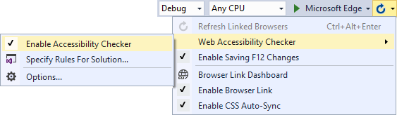
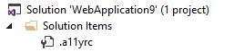
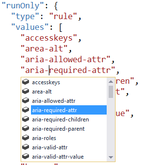
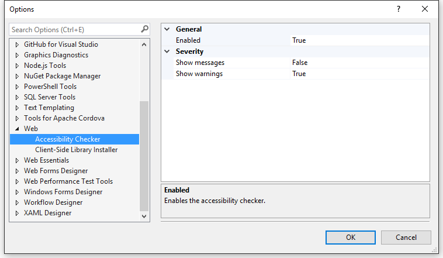
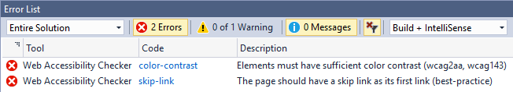
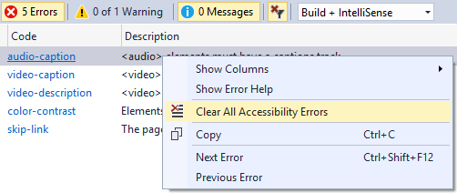

# Web Accessibility Checker

Download the extension at the
[VS Gallery](https://visualstudiogallery.msdn.microsoft.com/3aabefab-1681-4fea-8f95-6a62e2f0f1ec)
or get the
[CI build](http://vsixgallery.com/extension/25a79d25-0fff-4748-afaa-3a67ed116bc9/)

------------------------------------------

The easiest way to perform accessibility checks
on any ASP.NET web application. Fully customizable
and support all the major international accessibility standards.

## Features

- Uses Browser Link to test the running website
- Tests the actual DOM
- Integrates with the Visual Studio error list
- Supported accessibility standards
  - WCAG Level A
  - WCAG Level AA
  - Section 508
  - Other best practices
- All rules can be customzied per project/solution
- Works with MVC, WebForms, Web Pages and ASP.NET Core projects

### Connect with Browser Link

For this extension to work, make sure that Visual Studio's
Browser Link is up and running. Do that by running an
ASP.NET application from Visual Studio in one or more
browsers.

Hovering over the Browser Link button on the Standard
toolbar lets you know if Browser Link is connected.

## Commands
The Browser Link dropdown menu hosts the _Web Accessibility Checker_
sub menu.

There are multiple command buttons in the menu.

### Auto-Run on Page Load
This will automatically run the accessibility checker every
time a page loads in the browser - any browser.

### Run Now in All Browsers...
In addition to auto-running the checker on page load, doing it
on demand can be helpful when you need to interact with the
page to get it into a state you want to check.

This is also a great way of running on demand only if you disable
_Auto-Run on Page Load_.

### Specify Rules for Solution...
Clicking this command will add a configuration file to the
solution.

It's a JSON file containing all the rules being run. You can
customize it by adding and removing rules and there is full
Intellisense for all the rules.

### Settings
Some global settings can be configured in the option dialog.

## Accessibility rules
This extensions uses the [axe-core](https://github.com/dequelabs/axe-core)
library to perform the accessibility analysis.

All rules are completely customizable and can follow the
project or solution. 

See the full 
[list of rules](https://dequeuniversity.com/rules/axe/1.1)

## Error list
Errors found on the page will automatically populate the
Error List in Visual Studio.

In some cases it is known exactly where in the source code
the issue is and double-clicking the error take you straight
to the location.

To clear all accessbility errors from the Error List, simply
right-click and hit _Clear All Accessibility Errors_.

## Contribute
Check out the [contribution guidelines](.github/CONTRIBUTING.md)
if you want to contribute to this project.

For cloning and building this project yourself, make sure 
to install the
[Extensibility Tools 2015](https://visualstudiogallery.msdn.microsoft.com/ab39a092-1343-46e2-b0f1-6a3f91155aa6)
extension for Visual Studio which enables some features
used by this project.

## License
[Apache 2.0](LICENSE) 