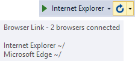

# Web Accessibility Checker

Download the extension at the
[VS Gallery](https://visualstudiogallery.msdn.microsoft.com/46eef4d9-045b-4596-bd7f-eee980bb5450)
or get the
[CI build](http://vsixgallery.com/extension/25a79d25-0fff-4748-afaa-3a67ed116bc9/)

------------------------------------------

The easiest way to perform accessibility checks
on any ASP.NET web application. Fully customizable
and support all the major international accessibility standards.

## Connect with Browser Link

For this extension to work, make sure that Visual Studio's
Browser Link is up and running. Do that by running an
ASP.NET application from Visual Studio in one or more
browsers.

Hovering over the Browser Link button on the Standard
toolbar lets you know if Browser Link is connected.

More info coming...

## Contribute
Check out the [contribution guidelines](.github/CONTRIBUTING.md)
if you want to contribute to this project.

For cloning and building this project yourself, make sure 
to install the
[Extensibility Tools 2015](https://visualstudiogallery.msdn.microsoft.com/ab39a092-1343-46e2-b0f1-6a3f91155aa6)
extension for Visual Studio which enables some features
used by this project.

## License
[Apache 2.0](LICENSE) 